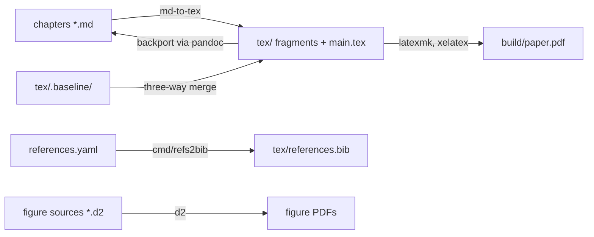

# paperkit

A Go library and two commands that build an academic paper from a directory of markdown chapters.

Papers rot when their build lives somewhere else: a manuscript copied between repositories stops compiling the day it loses the Makefile's parent directory. paperkit inverts that. A paper is one directory holding its chapters, its figures, its reference database, a `paper.yaml`, and a thin magefile; the directory builds anywhere this module is fetchable, and every default resolves inside it. Markdown stays the source of truth while LaTeX remains hand-editable: regeneration three-way-merges into the author's typesetting edits instead of overwriting them, and a backport pass carries prose edited in LaTeX back to the markdown.



## What a paper directory contains

| Entry | Role |
|---|---|
| `paper.yaml` | build description: title page, chapter roster, class, preamble, output |
| `NN-slug.md` | chapters, `00-title-page.md` first; frontmatter carries title, author, abstract |
| `references.yaml` | the paper's own CSL-YAML corpus |
| `d2/` | figure sources, compiled to vector PDF beside each source |
| `tex/` | generated LaTeX the author may hand-edit; `.baseline/` records what generation produced |
| `templates/` | the venue preamble |
| `magefile.go` | thin targets delegating here: tex, bib, figures, pdf, audit, backport, clean |

## Methodology

Conversion goes through [md-to-tex](https://github.com/petar-djukic/md-to-tex), which is a pure function; paperkit owns everything around it. `GenerateTex` converts the roster, rejects cross-chapter label collisions, and reconciles each fragment into `tex/` through a three-way merge against its baseline, so hand-edited typesetting survives regeneration. `PDF` runs latexmk with xelatex and fails the build when the log reports a glyph no font provides, because latexmk exits zero on that and the character silently vanishes from print. `Audit` reports stale LaTeX, missing figures, and undefined citations from an actual compile. `Backport` reads edited LaTeX back into markdown through pandoc and proposes the diff rather than applying it.

Two commands ship with the module. `cmd/refs2bib` converts the CSL-YAML corpus to BibTeX, normalizing date forms and organization authors that break `IEEEtran.bst`. `cmd/genoutline` renders a paper's section-requirements documents into a compilable outline, for papers drafted requirements-first.

## Use

```
go run github.com/magefile/mage pdf
```

from a paper directory whose `go.mod` requires this module. Requires d2, latexmk (TeX Live), and pandoc (backport only) on PATH.

## History

Extracted from [autogenic-systems](https://github.com/petar-djukic/autogenic-systems), where six papers build with it; the commit history of the extraction is preserved. The pandoc conversion engine this library once carried was removed before extraction — md-to-tex is the only engine.

## License

MIT. See [LICENSE](LICENSE).
